# Static Routing dan Dynamic Routing RIPv2
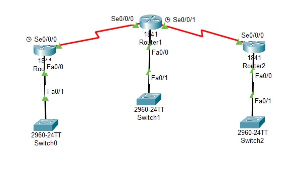
#### Router 1
```
ROUTER_I (config)#ip route 192.168.20.0 255.255.255.0 10.10.10.2
ROUTER_I (config)#ip route 10.20.10.0 255.255.255.252 10.10.10.2
ROUTER_I (config)#ip route 192.168.40.0 255.255.255.0 10.10.10.2
ROUTER_I (config)#show ip route
```
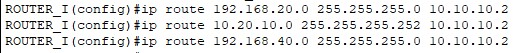
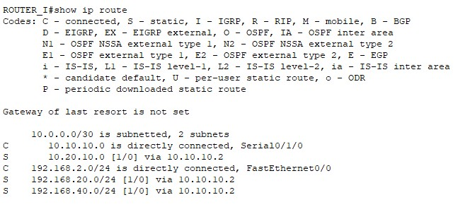
#### Router 2
```
ROUTER_II (config)#ip route 192.168.2.0 255.255.255.0 10.10.10.1
ROUTER_II (config)#ip route 192.168.40.0 255.255.255.0 10.20.10.2
ROUTER_II (config)#show ip route
```
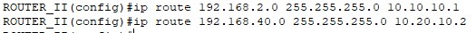
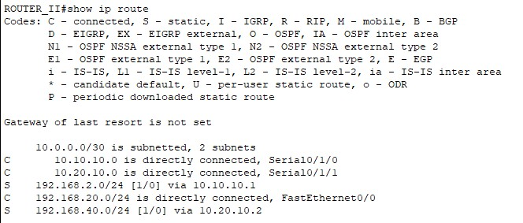
#### Router 3 
```
ROUTER_III (config)#ip route 192.168.2.0 255.255.255.0 10.20.10.1
ROUTER_III (config)#ip route 10.10.10.0 255.255.255.252 10.20.10.1
ROUTER_III (config)#ip route 192.168.20.0 255.255.255.0 10.20.10.1
ROUTER_III (config)#show ip route
```
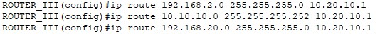
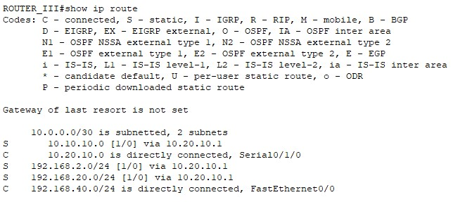

### Konfigurasi Default Route
#### Router I
```
ROUTER_I(config)#ip route 0.0.0.0 0.0.0.0 10.10.10.2
```
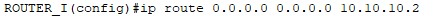
#### Router 2
```
ROUTER_II(config)#ip route 0.0.0.0 0.0.0.0 10.10.10.1
ROUTER_II(config)#ip route 0.0.0.0 0.0.0.0 10.20.10.2
```
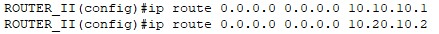
#### Router 3
```
Router_III(config)# ip route 0.0.0.0 0.0.0.0 10.20.10.1
```
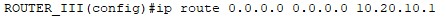

### Konfigurasi Dynamic Routing - RIPv1 & RIPv2 
#### Router 1
```
ROUTER_I(config)#router rip
ROUTER_I(config-router)#version 2
ROUTER_I(config-router)#network 192.168.2.0
ROUTER_I(config-router)#network 10.10.10.0
```
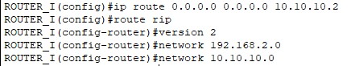
#### Router 2
```
ROUTER_II(config)#router rip
ROUTER_II(config-router)#version 2
ROUTER_II(config-router)#network 192.168.20.0
ROUTER_II(config-router)#network 10.10.10.0
ROUTER_II(config-router)#network 10.20.10.0
```
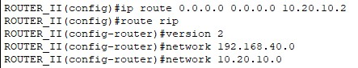
#### Router 3
```
ROUTER_III(config)#router rip
ROUTER_III(config-router)#version 2
ROUTER_III(config-router)#network 192.168.40.0
ROUTER_III(config-router)#network 10.20.10.0
```
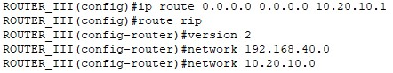
